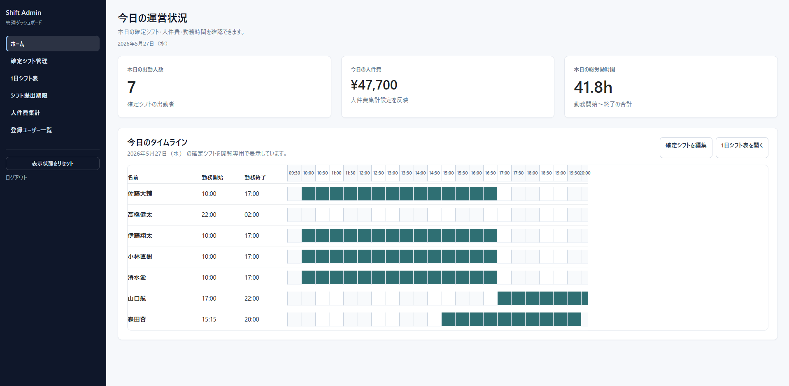
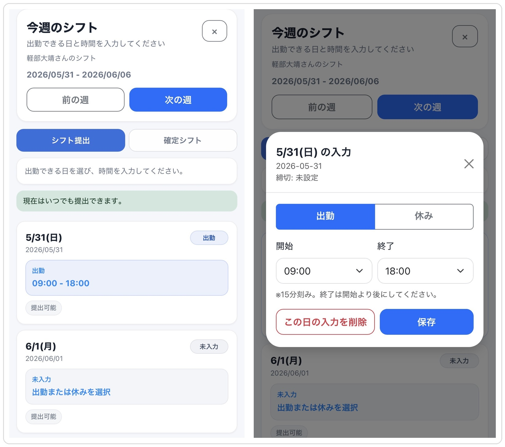
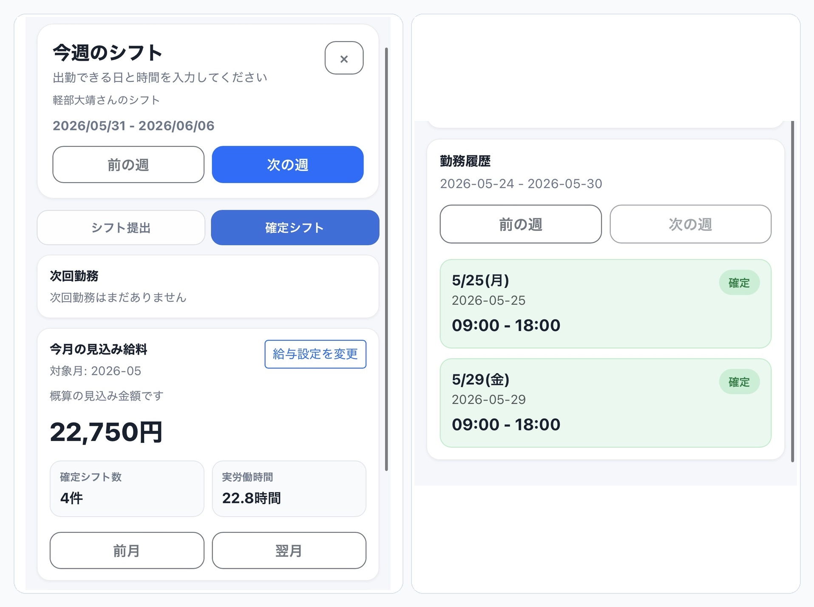
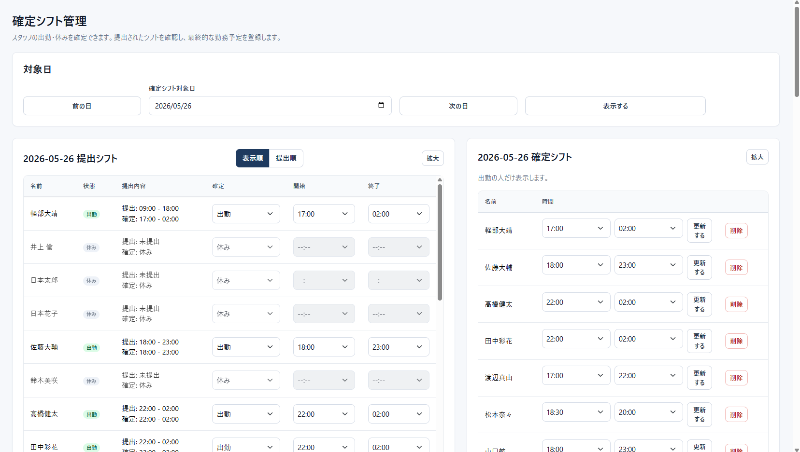
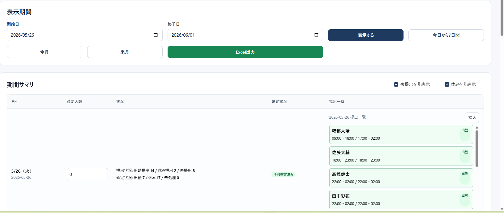
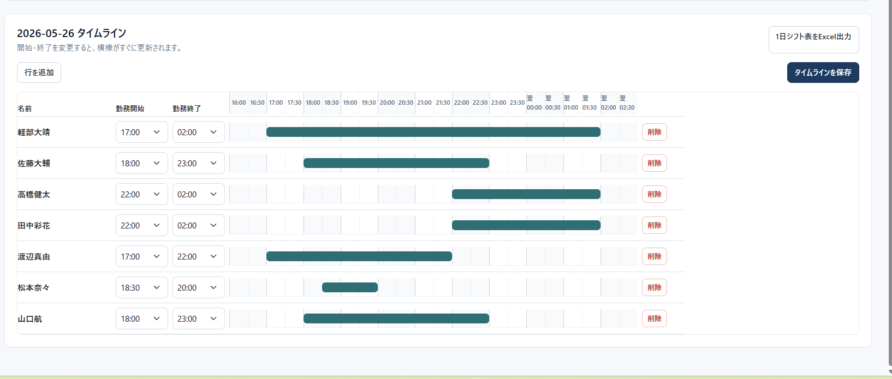
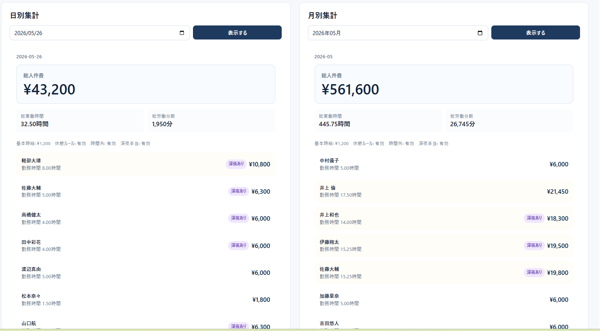

# シフト便

LINEでシフト提出、管理画面で確定。小規模店舗向けシフト管理ツール



## 概要

シフト便は、アルバイト・パートスタッフのシフト提出から、管理者による確定シフト作成、人件費集計、Excel出力までを一通り扱えるシフト管理ツールです。

従業員は普段使っているLINEからシフト希望を提出できます。管理者はWeb管理画面で提出状況を確認し、必要人数や勤務時間を調整したうえで確定シフトを作成できます。

父親の会社など、小規模事業者で実際に使うことを想定して開発しました。

## 開発背景

小規模店舗やアルバイト中心の職場では、シフト希望の回収・確認・確定作業が手作業になりがちです。

- LINEや口頭で提出された希望を管理者が手で集計している
- 未提出者や休み希望者の確認に時間がかかる
- 確定後のシフト表や人件費を別途作る必要がある
- 深夜勤務や日跨ぎ勤務があると集計が複雑になる

そこで、従業員が提出しやすいLINE画面と、管理者がまとめて確認・確定できるWeb管理画面を組み合わせました。

特に、従業員の希望である「提出シフト」と、実際に勤務する「確定シフト」を分けて設計しています。これにより、希望と最終決定を混同せず、確定シフトをもとにExcel出力や人件費集計を行えます。

## 主な機能

### 従業員向け

- LINE/LIFFによるシフト提出
- 日曜始まりの週単位入力
- 出勤・休みの提出
- 過去日の変更制限
- 提出期限の反映
- 確定シフトの確認
- 今月の概算給与・勤務時間の確認
- 給与設定の保存

### 管理者向け

- 登録ユーザー管理
- 表示順の変更
- シフト提出期限設定
- 確定シフト管理
- 出勤・休み・未処理の切り替え
- 未提出者を休みとして保存
- 未提出・休み非表示フィルター
- 期間サマリ
- 必要人数設定
- 提出一覧の拡大表示
- 1日シフト表
- タイムライン表示
- 表示時間の自動調整・手動保存
- Excel出力
- 日跨ぎシフト対応
- 人件費集計
- 深夜手当・休憩・時間外労働設定
- Web版利用説明書
- PDF版利用説明書

## 画面イメージ

### 従業員側のシフト提出

LINE上で、出勤できる日と時間を入力できます。週の切り替え、休み提出、確定シフトの確認にも対応しています。



### 従業員側の確定シフト・見込み給与

確定シフト、勤務履歴、今月の概算給与を確認できます。給与は確定シフトをもとに計算します。



### 管理者ホーム

今日の出勤人数、人件費、総労働時間を確認できます。今日のタイムラインも閲覧できます。


### 確定シフト管理

提出内容を確認しながら、出勤・休み・未処理を決定できます。未提出者を出勤や休みにする運用にも対応しています。



### 期間サマリ

指定期間の提出状況・確定状況・必要人数を日別に確認できます。人数が増えても見やすいように、フィルターや拡大表示を用意しています。



### 1日シフト表

確定シフトをタイムラインで確認できます。日跨ぎシフトも横棒で表示できます。



### 人件費集計

日別・月別の概算人件費を確認できます。休憩、深夜手当、時間外労働を考慮した計算に対応しています。



## 技術スタック

- Python
- Flask
- SQLite
- PostgreSQL / Supabase
- LINE Messaging API
- LIFF
- HTML / CSS / JavaScript
- openpyxl
- Render

## 設計上の工夫

### 提出シフトと確定シフトを分離

従業員が入力した希望は `shift_entries`、管理者が最終決定した勤務予定は `confirmed_shifts` として分けています。

これにより、休み希望の人を出勤に変更したり、未提出者を休みにしたりしても、本人の提出状況と管理者の確定内容を別々に扱えます。

### 確定シフトを中心に集計

人件費、Excel出力、1日シフト表は確定シフトをもとに作成します。提出希望だけでは勤務扱いにしないため、実際の運用に近い集計ができます。

### 日跨ぎシフトに対応

`22:00 - 02:00` のような深夜勤務を保存・表示・計算できます。終了時刻が開始時刻より前の場合は、翌日終了として扱います。

### 人数が増えても使いやすいUI

20人規模での確認を想定し、提出一覧や確定シフト一覧には内部スクロール・拡大表示・フィルターを実装しました。

### 実運用向けの説明書

管理画面内にWeb版の「使い方」ページを用意しています。PDF保存用のページも別に用意し、操作説明書として共有できるようにしました。

### Render + Supabase環境を想定

ローカルではSQLite、本番ではDATABASE_URLがあればPostgreSQLを使う構成にしています。Renderの再デプロイでSQLiteが消える問題を避けるため、Supabase PostgreSQLにも対応しました。

## ディレクトリ構成

```text
shift_bot/
├─ app.py                  # Flaskアプリの起動
├─ config.py               # 環境変数の読み込み
├─ db.py                   # DB接続・テーブル初期化
├─ routes/                 # 画面・APIルート
├─ services/               # 業務ロジック
├─ repositories/           # DB操作
├─ templates/              # HTMLテンプレート
├─ static/                 # CSS・画像など
├─ scripts/                # 補助スクリプト
├─ docs/                   # 説明書・ポートフォリオ資料
├─ requirements.txt
└─ README.md
```

## セットアップ方法

```bash
python -m venv venv
venv\Scripts\activate
pip install -r requirements.txt
copy .env.example .env
python app.py
```

起動後、ブラウザで以下を開きます。

```text
http://127.0.0.1:5000/admin
```

## 環境変数

`.env.example` をコピーして `.env` を作成してください。本物のトークンやパスワードはGitHubに載せないでください。

```env
DB_PATH=shift.db
DATABASE_URL=
FLASK_SECRET_KEY=change-me
ADMIN_PASSWORD=change-me
LINE_CHANNEL_SECRET=
LINE_CHANNEL_ACCESS_TOKEN=
LIFF_ID=
ADMIN_TIMING_LOG=0
```

## デモ用データ

UI確認用に、ローカル環境だけで使うデモデータ作成スクリプトを用意しています。

```bash
python scripts/add_dummy_data.py
python scripts/remove_dummy_data.py
```

`add_dummy_data.py` はデモ用スタッフと提出シフトを追加します。`remove_dummy_data.py` は追加したデモ用スタッフだけを削除します。

本番環境では基本的に実行しません。実行前に対象DBのパスと確認メッセージが表示されるようにしています。

## 利用説明書

管理画面のサイドバーから「使い方」を開くと、Web版の利用説明書を確認できます。

- Web版: `/admin/manual`
- PDF保存向け: `/admin/manual/pdf`

PDF版はブラウザで開いて `Ctrl + P` から「PDFに保存」を選ぶことで、印刷・共有用の資料として使えます。

## 今後の改善予定

- 実店舗での試験運用
- シフト確定時のLINE通知
- 管理者権限の分離
- スマホ向け管理画面のさらなる改善
- 店舗ごとの設定分離

## アピールポイント

このアプリは、身近な事業者の「シフト管理をもっと楽にしたい」という課題から開発しました。

単に入力フォームを作るだけでなく、実際の運用で必要になる「提出」と「確定」の違い、未提出者の扱い、日跨ぎ勤務、人件費、Excel共有、操作説明書まで含めて設計しています。

要件整理、DB設計、Flaskでの実装、LINE/LIFF連携、管理画面UI、Excel出力、Render/Supabase対応、利用説明書作成まで一通り行いました。

「自分だけが使えるツール」ではなく、他の人が見ても使い方が分かる状態を目指した個人開発です。

## 注意

- `.env` には秘密情報を入れるため、GitHubにコミットしません
- DBファイル、仮想環境、キャッシュファイルもコミットしません
- LINEのトークンや管理者パスワードは公開しません
- デモ用データは本番環境では基本的に使いません

